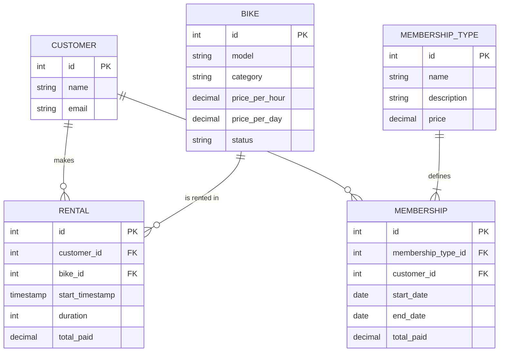

# 🚲 Bike Shop Rental & Sales Analysis


## 📌 Project Overview
This project analyzes the database of a bike rental shop to help the owner optimize inventory, design pricing strategies, and track revenue streams. The repository contains the full database schema, sample data, and advanced SQL analysis scripts.

## 📂 Repository Structure
The project files are organized as follows:

| Folder/File | Description |
| :--- | :--- |
| **Sql_Script.sql/** | Directory containing all source code. |
| ├── `schema_creation & insertion.sql` | Contains DDL (CREATE) and DML (INSERT) statements to build the database. |
| ├── `solution.sql` | Contains the analytical queries solving key business problems. |

## 🗄️ Database Schema
The database consists of five relational tables: `customer`, `bike`, `rental`, `membership`, and `membership_type`.

### Entity Relationship Diagram (ERD)


## 🔍 Analysis Highlights

### 1. 🏷️ Seasonal Pricing Strategy
**Problem:** The shop needs a winter pricing model to boost sales.
**Logic:** * **Electric Bikes:** 10% off hourly, 20% off daily.
* **Mountain Bikes:** 20% off hourly, 50% off daily.
* **Others:** 50% off everything.

```sql
SELECT 
    id, category, 
    price_per_hour AS old_hourly,
    CASE 
        WHEN Category = 'electric' THEN price_per_hour * 0.90 
        WHEN Category = 'mountain bike' THEN price_per_hour * 0.80
        ELSE price_per_hour * 0.50
    END AS new_hourly,
    price_per_day AS old_daily,
    CASE 
        WHEN Category = 'electric' THEN price_per_day * 0.80 
        WHEN Category = 'mountain bike' THEN price_per_day * 0.50
        ELSE price_per_day * 0.50 
    END AS new_daily
FROM bike;
```

### 2. 👥 Customer Segmentation
**Problem:** Segment customers based on rental frequency to identify VIPs.
**Segments:**
* **High:** > 10 rentals
* **Medium:** 5 - 10 rentals
* **Low:** < 5 rentals

```sql
WITH Count_rent AS (
    SELECT
        c.name,
        COUNT(r.bike_id) AS Total_rentals 
    FROM customer c 
    LEFT JOIN rental r ON r.customer_id = c.id
    GROUP BY c.name 
)
SELECT
    CASE 
        WHEN Total_rentals > 10 THEN 'more than 10' 
        WHEN Total_rentals BETWEEN 5 AND 10 THEN 'between 5 and 10' 
        WHEN Total_rentals < 5 THEN 'less than 5'
    END AS rental_count_category,
    COUNT(*) AS Total_customers
FROM Count_rent
GROUP BY rental_count_category;
```

### 3. 🚲 Fleet Availability
**Problem:** Determine the current status of the bike fleet.
**Insight:** Uses pivot logic to count available vs. rented vs. out-of-service bikes per category.

```sql
SELECT 
    Category,
    COUNT(*) as Total_Fleet,
    COUNT(CASE WHEN status = 'available' THEN 1 END) As Available_Count,
    COUNT(CASE WHEN status = 'rented' THEN 1 END) As Rented_Count,
    COUNT(CASE WHEN status = 'out of service' THEN 1 END) As Out_of_Service_Count
FROM bike 
GROUP BY Category;
```

## 📑 Additional Financial Reports
<details>
<summary><strong>Click to expand: Rental Revenue Report (Rollup)</strong></summary>
This query generates a comprehensive sales report showing total revenue from rentals by Month, Year, and a Grand Total across all years using <code>UNION ALL</code> for manual rollups.

```SQL
SELECT 
    YEAR(start_timestamp) As Year,
    MONTH(start_timestamp) As Month,
    SUM(total_paid) as Total_revenue
FROM rental
GROUP BY Year, Month
UNION ALL
SELECT 
    YEAR(start_timestamp) As Year,
    NULL As Month,
    SUM(total_paid) as Total_revenue
FROM rental
GROUP BY Year
UNION ALL
SELECT 
    NULL As Year,
    NULL As Month,
    SUM(total_paid) as Total_revenue
FROM rental
ORDER BY (Year IS NULL), Year;
```
</details>

<details> 
<summary><strong>Click to expand: Customer Membership Counts</strong></summary>
This query lists all customers and the number of memberships they have purchased, ensuring customers with 0 purchases are still listed (using <code>LEFT JOIN</code>).

```SQL
SELECT
    c.name,
    COUNT(m.membership_type_id) As membership_count
FROM customer c 
LEFT JOIN membership m ON c.id = m.customer_id
GROUP BY c.name 
ORDER BY membership_count DESC;
```
</details>


## 🚀 How to Run

1.  **Clone the Repository:**
    ```bash
    git clone [https://github.com/yourusername/bike-shop-analysis.git](https://github.com/yourusername/bike-shop-analysis.git)
    ```
2.  **Initialize Database:**
    * Open your SQL client (MySQL Workbench, DBeaver, etc.).
    * Navigate to the `Sql_Script.sql` folder.
    * Run `schema_creation & insertion.sql`. This will drop existing tables and create the new schema with data.
3.  **Run Analysis:**
    * Execute `solution.sql` to generate the insights and reports.

## 🛠️ Tech Stack
* **Database:** MySQL
* **Concepts Used:** * **DDL/DML:** Table creation and data insertion.
    * **Aggregations:** `GROUP BY`, `COUNT`, `SUM`.
    * **Complex Logic:** `CASE` statements for pricing and pivoting.
    * **Joins:** `LEFT JOIN` to include customers with zero rentals.
    * **CTEs:** For readable segmentation logic.
